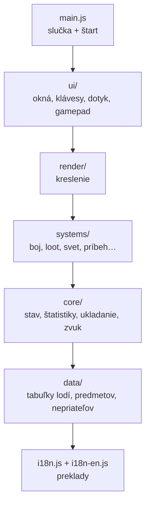
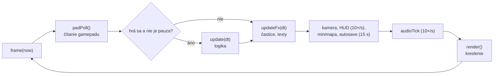
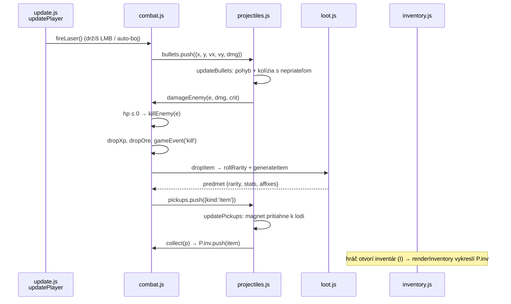

# Void Harvest – technická dokumentácia

Tento dokument vysvetľuje, ako je hra postavená: čo kde leží, ako spolu časti súvisia a čo treba upraviť, keď chceš niečo zmeniť. Píše sa pre niekoho, kto programovať vie (základy JavaScriptu, HTML, Gitu), ale tento projekt zatiaľ nepozná.

> Súvisiace dokumenty: [`README.md`](../README.md) (ovládanie, spustenie), [`AUDIT.md`](AUDIT.md) (audit a plán opráv), [`CLAUDE.md`](../CLAUDE.md) (stručné poznámky pre AI asistenta – hutná verzia tohto dokumentu).

## Obsah
1. [Hra v skratke](#1-hra-v-skratke)
2. [Spustenie, testy, nasadenie](#2-spustenie-testy-nasadenie)
3. [Mapa priečinkov](#3-mapa-priečinkov)
4. [Ako sa hra načíta](#4-ako-sa-hra-načíta)
5. [Herná slučka](#5-herná-slučka)
6. [Stav hry – globálne premenné](#6-stav-hry--globálne-premenné)
7. [Štatistiky lode – `computeStats`](#7-štatistiky-lode--computestats)
8. [Herné systémy – kde čo je](#8-herné-systémy--kde-čo-je)
9. [Príklad toku: od výstrelu po predmet v inventári](#9-príklad-toku-od-výstrelu-po-predmet-v-inventári)
10. [Vykresľovanie](#10-vykresľovanie)
11. [Používateľské rozhranie a ovládanie](#11-používateľské-rozhranie-a-ovládanie)
12. [Ukladanie hry](#12-ukladanie-hry)
13. [Preklady (slovenčina / angličtina)](#13-preklady-slovenčina--angličtina)
14. [Zvuk a hudba](#14-zvuk-a-hudba)
15. [Assety: 3D sprity, hudba, licencie](#15-assety-3d-sprity-hudba-licencie)
16. [Nástroje v priečinku `tools/`](#16-nástroje-v-priečinku-tools)
17. [Kuchárka: kde čo zmeniť](#17-kuchárka-kde-čo-zmeniť)
18. [Ladenie a hľadanie chýb](#18-ladenie-a-hľadanie-chýb)
19. [Pravidlá a časté chyby](#19-pravidlá-a-časté-chyby)
20. [Slovník pojmov](#20-slovník-pojmov)

---

## 1. Hra v skratke

Void Harvest je 2D vesmírna strieľačka s progresiou v štýle Diabla (úrovne, predmety s raritami, talenty, bossovia).

| Vlastnosť | Riešenie |
|---|---|
| Jazyk | čistý JavaScript (bez frameworku, bez TypeScriptu) |
| Grafika | HTML5 `<canvas>` 2D, vlastné kreslenie + predrenderované obrázky 3D modelov |
| UI (okná, HUD) | obyčajné HTML + CSS nad canvasom |
| Zvuk | Web Audio API (efekty sa generujú kódom), hudba sú súbory OGG / MP3 |
| Ukladanie | `localStorage` prehliadača (žiadny server) |
| Build | žiadny nie je potrebný; voliteľne `tools/build.js` zloží všetko do jedného HTML |
| Hosting | GitHub Pages servuje priamo koreň repozitára |

Celá hra beží v prehliadači hráča. Neexistuje backend ani databáza.

---

## 2. Spustenie, testy, nasadenie

**Hranie lokálne:** otvor `index.html` dvojklikom. Hra funguje aj z `file://`, server netreba (preto nepoužíva ES moduly – pozri kapitolu 4).

**Vývoj:**
```bash
npm install            # nainštaluje playwright, acorn (iba pre testy)
npm run build          # vytvorí dist/void-harvest.html (všetko v jednom súbore)
npm run i18n           # vypíše slovenské texty, ktorým chýba anglický preklad
npm test               # build + kontrola prekladov + automatické odohranie hry
```

`npm test` spustí `tools/smoke.js`, ktorý v headless Chromiu:
- spustí každú zo 4 lodí v slovenskej aj anglickej verzii,
- chvíľu hrá (strieľa, zbiera, zvyšuje úroveň),
- otvorí všetky okná,
- zachytí každú chybu JavaScriptu.

Úspech vyzerá takto (riadok „bez chýb“ pre každú verziu):
```
== index.html [sk]
  interceptor: lvl 31, zostrely 8
  …
  bez chýb
```

**Nasadenie:** `git push` do vetvy `main`. GitHub Pages do minúty zverejní novú verziu na https://dzizka.github.io/void-harvest/. Nič sa nekompiluje.

---

## 3. Mapa priečinkov

```
void-harvest/
├── index.html            kostra stránky: canvas, HUD, všetky okná (panely), poradie skriptov
├── css/
│   ├── fonts.css         písma uložené v repozitári (assets/fonts/, bez Google Fonts)
│   ├── base.css          farby (CSS premenné), rámy, výber lode v hangári
│   ├── hud.css           HUD v hre, spodná lišta, bannery
│   ├── panels.css        inventár, talenty, mapa, stanica, tooltip
│   ├── features.css      cheat menu, brány, dielňa, paragon, zámky kariet…
│   └── touch.css         všetko pre mobil (platí iba s triedou body.touch)
├── js/
│   ├── i18n.js           prekladové funkcie _L a _T
│   ├── i18n-en.js        anglický slovník (najväčší súbor, ~168 kB)
│   ├── core/             jadro: util, audio, stats, state, save, update
│   ├── data/             herné dáta: lode, predmety, afixy, talenty, nepriatelia, sektory
│   ├── systems/          herné mechaniky: boj, loot, svet, schopnosti, príbeh, základňa…
│   ├── render/           kreslenie: pozadie, lode, nepriatelia, efekty, 3D sprity
│   ├── ui/               okná a ovládanie: HUD, inventár, stanica, klávesy, dotyk, gamepad
│   └── main.js           hlavná slučka a štart
├── assets/
│   ├── sprites/*.webp    predrenderované obrázky 3D modelov (sprite sheety)
│   ├── models/           zdrojové 3D modely (OBJ/GLB) – hra ich priamo nepoužíva
│   ├── music/            hudba (OGG + MP3)
│   ├── fonts/            písma Chakra Petch a JetBrains Mono (woff2, licencia OFL)
│   ├── icons/            ikony aplikácie (PWA, favicon)
│   └── CREDITS.md        autori a licencie assetov
├── tools/                build, test, kontrola prekladov, renderer 3D spritov
├── manifest.json         popis aplikácie pre inštaláciu na plochu (PWA)
├── sw.js                 service worker: offline hra a inštalácia (iba cez http/https)
├── docs/                 AUDIT.md, AUDIT-2.md, tento dokument
├── dist/                 výstup buildu (negeneruje sa do Gitu)
└── CLAUDE.md, README.md
```

### Vrstvy kódu

Dá sa to chápať ako vrstvy. Vyššia vrstva smie používať nižšiu, nie naopak (pri načítaní):



Skutočné poradie je mierne premiešané (napr. `core/update.js` sa načíta neskôr). Platné poradie je vždy to v `index.html`.

---

## 4. Ako sa hra načíta

`index.html` načíta CSS a potom asi 50 JS súborov ako **klasické skripty** (`<script src="…">`, nie `type="module"`):

```html
<script src="js/i18n.js"></script>
<script src="js/i18n-en.js"></script>
<script src="js/core/util.js"></script>
...
<script src="js/ui/gamepad.js"></script>
<script src="js/main.js"></script>
```

**Čo to znamená:**

1. **Jeden spoločný globálny priestor.** Funkcia `function damageEnemy()` v `combat.js` je viditeľná všade ako globálna. Netreba žiadne `import` ani `export`.
2. **Poradie je dôležité pri kóde, ktorý sa vykoná hneď.** Kód na najvyššej úrovni súboru (mimo funkcií) beží v momente načítania. Môže použiť iba veci zo súborov, ktoré sa načítali **skôr**.
   - Príklad: `const GEM_Q = [_L('Úlomkový'), …]` v `game-data.js` funguje, lebo `_L` je z `i18n.js`, ktorý sa načítal pred ním.
   - Vo vnútri funkcií to nevadí. Telo funkcie sa spustí až neskôr, keď sú už načítané všetky súbory.
3. **Prečo nie ES moduly?** Prehliadač z bezpečnostných dôvodov nenačíta moduly cez `file://`. Hra by sa potom nedala spustiť dvojklikom.
4. Každý súbor začína `'use strict';` (prísny režim: chyby namiesto tichých omylov).
5. `const` a `let` na najvyššej úrovni sú tiež zdieľané medzi súbormi, ale nie sú vlastnosťou `window`. V konzole ich zavoláš priamo (`P.level`), nie `window.P`.

**Štart hry** (koniec `js/main.js`):
```js
translateStatic();      // preloží statické texty v HTML
resize();               // nastaví veľkosť canvasu
loadAccount();          // načíta účet z localStorage
migrateLegacySave();    // prevedie staré uložené hry
initBackground();       // hviezdy v pozadí
buildSelect();          // hangár (výber lode)
renderContinue();       // tlačidlo „Pokračovať“
requestAnimationFrame(frame);   // spustí hlavnú slučku
```

Keď hráč vyberie loď, zavolá sa `startGame(cls, data)` v `js/core/save.js`. Vytvorí hráča `P`, stav `G` a načíta sektor.

---

## 5. Herná slučka

Hra beží v slučke cez `requestAnimationFrame`. Prehliadač volá funkciu `frame(now)` (v `main.js`) zvyčajne 60× za sekundu, na niektorých monitoroch 120×.



**`dt` (delta time)** je čas od poslednej snímky v sekundách (≈ 0,016 pri 60 FPS). Všetok pohyb sa ním násobí: `x += vx * dt`. Hra tak beží rovnako rýchlo na 60 aj 144 Hz. `dt` je obmedzené na max. 0,05 s, aby sa po zaseknutí nič „neteleportovalo“.

**`update(dt)`** (`js/core/update.js`) volá podsystémy v pevnom poradí:
```
updatePlayer → updateAbilities → director / dungeonDirector → updateAsteroids
→ updateEnemies → updateBullets → updateEnemyBullets → updateMissiles → updatePickups
→ updateMythic → updateHazards → updateDrones → updateMinions → … → tickStory
→ upratanie mŕtvych entít (prune) → updateInteract
```

Logika a kreslenie sú oddelené. `update` iba mení čísla (pozície, životy). `render` ich iba kreslí. Vďaka tomu testy volajú `update(1/60)` v cykle bez kreslenia a hru „pretočia“ rýchlejšie ako v reálnom čase.

**Pauza:** keď je otvorené okno (`G.panel`), `G.paused = true` a `update` sa nevolá. Kreslí sa ďalej.

---

## 6. Stav hry – globálne premenné

Celý stav hry žije v niekoľkých globálnych objektoch:

| Premenná | Kde vzniká | Čo obsahuje |
|---|---|---|
| `G` | `startGame` (`save.js`) | **Game** – stav relácie: aktuálny sektor, čas, otvorené okno `G.panel`, brána `G.dungeon`, búrka `G.storm`, prepínače auto-boja, cheaty `G.cheat` |
| `P` | `createPlayer` (`state.js`) | **Player** – loď hráča: pozícia `x, y`, rýchlosť `vx, vy`, uhol `a`, úroveň, XP, ruda, výbava `P.equip`, inventár `P.inv`, talenty, schopnosti, vypočítané štatistiky `P.stats` |
| `ACC` | `loadAccount` (`save.js`) | **Account** – všetko spoločné pre všetky lode: sklad, materiály, základňa, úspechy, sezóna, majáky, pošta |
| `enemies`, `asteroids`, `bullets`, `ebullets`, `missiles`, `pickups`, `particles`, `texts`, `minions`… | `state.js` | polia entít v sektore. Každá entita je obyčajný objekt `{ x, y, vx, vy, hp, … }` |
| `input` | `state.js` | stav ovládania: stlačené klávesy, myš, `fire`, `missile`, `dodge`, `skill[]` |
| `view`, `cam` | `bindings.js` | veľkosť okna, zoom, poloha kamery |
| `TOUCH`, `PAD` | `state.js` | stav dotykového ovládania a gamepadu |
| `GFX`, `AUD` | `background.js`, `audio.js` | nastavenia grafiky a zvuku |

**Entity nie sú triedy.** Nepriateľ je napríklad:
```js
{ type: 'fighter', x: 1200, y: 800, vx: 0, vy: 0, hp: 46, maxHp: 46, r: 14, T: ENEMY_TYPES.fighter, dead: false, … }
```
Keď zomrie, nastaví sa `dead = true`. Na konci snímky ho `prune(enemies, e => !e.dead)` vyhodí z poľa. Mazanie počas prechádzania poľa by rozbilo cyklus, preto sa entity iba označia a vyhodia na konci.

---

## 7. Štatistiky lode – `computeStats`

`computeStats(cls, equip, tal, level, para)` v `js/core/stats.js` je **jediné miesto**, kde sa počítajú výsledné štatistiky lode (poškodenie, kadencia, štíty, rýchlosť, kritická šanca…).

Vstupy, ktoré skladá dokopy:
1. základ lode z `CLASSES` (`game-data.js`),
2. predmety vo výbave (základné hodnoty, afixy, vylepšenia, drahokamy),
3. talenty a paragon,
4. bonusy setov, výskum základne (`researchFx`), majáky (`beaconFx`), stimulanty.

Výsledok sa uloží do `P.stats`. Volá ho `recalcStats()` (`state.js`) po každej zmene výbavy, úrovne alebo talentu.

Rovnaká funkcia sa volá aj pri porovnávaní predmetov v tooltipe. Hra ju zavolá s „čo keby“ výbavou a ukáže rozdiel. **Ak pridáš nový bonus, pridaj ho sem, inak ho hra ignoruje aj v tooltipe.**

---

## 8. Herné systémy – kde čo je

| Systém | Súbor | Kľúčové funkcie / dáta |
|---|---|---|
| Lode (triedy) | `data/game-data.js` | `CLASSES` (trup, štít, rýchlosť, štartovná výbava) |
| Predmety, rarity, afixy | `data/game-data.js`, `systems/loot.js` | `RARITY`, `SLOTS`, `AFFIXES`, `LEGEND_POOL`, `MYTHIC_LIST`, `generateItem`, `rollRarity`, `RARITY_TABLES` |
| Sety | `data/sets.js` | `SET4` |
| Nepriatelia, bossovia, sektory | `data/sets.js` | `ENEMY_TYPES`, `BOSSES`, `SECTORS`, `DUNGEON` |
| Talenty | `data/talents.js`, `ui/talents.js` | `TREES` |
| Spawn nepriateľov | `systems/enemies.js` | `director` (otvorený svet), správanie `updateEnemies` (`switch (e.type)`), vzory bossov `runBossPattern` |
| Vytvorenie nepriateľa | `core/state.js` | `spawnEnemy(type, x, y, lvl, elite)`, elitné modifikátory `ELITE_MODS` |
| Boj | `systems/combat.js` | `fireLaser`, `fireMissiles`, `damageEnemy`, `killEnemy`, `hurtPlayer`, `die`, `gainXp`, `dropItem`, `collect` |
| Strely, loot na zemi, častice | `systems/projectiles.js` | `updateBullets`, `updateEnemyBullets`, `updateMissiles`, `updatePickups`, `updateFx` |
| Úhyb a schopnosti | `systems/abilities.js` | `DODGES`, `SKILLS`, `castSkill`, `useDodge` |
| Drony, minióni | `systems/companions.js` | `updateDrones`, `updateMinions` |
| Sektory, brány, bossovia | `systems/world.js` | `loadSector`, `warpTo`, `enterDungeon`, `dungeonDirector`, `spawnBoss` |
| Výstup do Prázdnoty, Trezor, Svetový boss | `systems/climb.js`, `vault-rush.js`, `world-boss.js` | |
| Búrka, pevnosti, horda | `systems/endgame-events.js` | `G.storm`, `G.forts`, `G.dungeon.horde` |
| Udalosti v sektore, kontrakty | `systems/events.js` | `updateEvent`, `CONTRACTS` |
| Skener, anomálie, majáky, hrozby | `systems/exploration.js` | `BEACON_BONUS`, `SECTOR_HAZ` |
| Materiály, základňa, expedície | `systems/base.js` | `MATS`, `MODULES` |
| Príbeh a sezóny | `systems/story.js` | `NPCS`, `CHAPTERS`, `gameEvent(type, data)` |
| Úspechy, tutoriál, odomykanie | `systems/journal.js` | `ACH`, `TUT`, `UNLOCK` |
| Úrovne | `core/state.js` | `xpNeed(lvl)`, `LEVEL_CAP` (`game-data.js`) |

### Komunikácia medzi systémami

Systémy sa navzájom priamo volajú (všetko je globálne). Pre príbeh a úlohy existuje jednoduchý „event bus“: `gameEvent('kill', { e })`, `gameEvent('gate')`, … Príbeh (`story.js`) tieto udalosti počúva a posúva úlohy. Nový systém, ktorý má posúvať príbeh, len zavolá `gameEvent`.

---

## 9. Príklad toku: od výstrelu po predmet v inventári

Takto ide jedna akcia cez viac súborov. Dobrý spôsob, ako sa v kóde zorientovať:



---

## 10. Vykresľovanie

`render()` v `js/render/render.js` kreslí každú snímku na jeden `<canvas>` v tomto poradí (čo je neskôr, je navrchu):

1. pozadie: hviezdy, hmloviny, planéty (`background.js`, `makeBackdrop` sa predkreslí raz na sektor do samostatného canvasu),
2. stanica, brány, asteroidy,
3. loot na zemi, nepriatelia (`drawEnemy`), rakety,
4. efekty schopností, hrozby,
5. strely hráča a nepriateľov,
6. loď hráča (`drawShip`) a štít,
7. častice (aditívne miešanie `'lighter'` = svietia),
8. žiara (`drawGlow`, len pri grafike „vysoká“),
9. plávajúce texty (poškodenie), prekrytia (búrka, radiácia).

**Kamera:** pred kreslením sveta sa nastaví transformácia `ctx.setTransform(...)` podľa `cam.x/cam.y` a zoomu. Ďalší kód potom kreslí vo **svetových súradniciach** (`e.x, e.y`). Prepočet na pixely obrazovky robí canvas sám.

**Orezanie (culling):** funkcia `vis(x, y, r)` vráti, či je objekt na obrazovke. Čo nie je vidieť, sa nekreslí.

**3D sprity** (`js/render/models3d.js`):
- 3D modely sa vopred vyrenderujú z mnohých uhlov do jedného obrázka, tzv. *sprite sheet* (napr. 48 snímok dookola).
- Hra si podľa uhla lode vyberie správne políčko: `drawSpr(ctx, S, x, y, uhol, veľkosť, riadok)`.
- Lode majú 3 riadky na náklon (doľava, rovno, doprava).
- `spr3d('en_fighter')` vráti sheet, alebo `null`, kým sa obrázok nenačíta. Vtedy sa nakreslí pôvodná vektorová verzia. Hra teda funguje aj bez obrázkov (Menu → 3D modely vypne).

**Kvalita grafiky** (`GFX.q`: `high` / `mid` / `low`, Menu → Grafika): `high` pridáva žiaru cez celú obrazovku, `low` polovicu častíc a nemá scenériu pozadia.

---

## 11. Používateľské rozhranie a ovládanie

### Okná (panely)
Všetky okná (inventár, talenty, mapa, stanica…) sú pripravené v `index.html` ako skryté `<div>`. Otvára ich:
```js
openPanel('inv');   // prepne G.panel = 'inv' a zavolá syncPanels()
closePanels();      // zavrie všetko a uloží hru
```
`syncPanels()` (`ui/hud.js`) nastaví `hidden` podľa `G.panel` a pozastaví hru. Obsah okna sa vygeneruje funkciou `render…` daného okna (napr. `renderInventory`, `renderStation`) ako HTML reťazec do `innerHTML`.

### HUD
`updateHUD()` (`ui/hud.js`) beží 10× za sekundu a aktualizuje pruhy (trup, štít, XP), rudu, kontrakty a ikonky schopností.

### Klávesnica a myš
`ui/bindings.js`:
- `keydown` / `keyup` → `input.keys[e.code]` (napr. `input.keys.KeyW`),
- myš → `input.mx`, `input.my`, `input.fire`,
- jednorazové akcie (`Q`, `Space`, `E`…) nastavia príznak (`input.skill[0] = true`), ktorý herná logika v najbližšej snímke spotrebuje a vynuluje.

### Dotyk (mobil)
- `ui/touch.js` a `css/touch.css`, zapína sa triedou `body.touch`.
- Ľavá virtuálna páčka zapisuje `input.mv`, pravá `input.aim`.
- Trik: `touchAim()` posunie „virtuálnu myš“ pred loď, takže kód písaný pre myš funguje bez zmeny.

### Gamepad
`ui/gamepad.js`, `padPoll()` sa volá každú snímku. Rovnaký trik s virtuálnou myšou (`padAim()`). Aktívny od prvého stlačenia, kým nepohneš myšou.

---

## 12. Ukladanie hry

Všetko je v `localStorage` prehliadača. Ide o úložisko typu kľúč → text, ~5 MB na doménu.

| Kľúč | Obsah |
|---|---|
| `void-harvest-account-v1` | účet `ACC` (sklad, materiály, základňa, úspechy, sezóna…) |
| `void-harvest-save-v1:interceptor` (a ďalšie lode) | jedna uložená hra na loď: `P` (úroveň, výbava, inventár, talenty…) + časť `G` |
| `void-harvest-lang`, `-gfx`, `-audio`, `-touch`, `-models` | nastavenia |
| `…-corrupt-<čas>` | záloha poškodeného uloženia (ak sa nedá prečítať) |

**Kedy sa ukladá:** každých 15 s, pri zatvorení herného okna (panelu) a pri odchode zo stránky (`pagehide`). Ukladá `saveGame()` v `core/save.js`, na objekty použije `JSON.stringify`.

**Spätná kompatibilita:** keď pridáš nové pole, staré uloženia ho nemajú. Doplň ho pri načítaní v `restoreSave` (hra) alebo `loadAccount` (účet), napr. `P.novePole = d.P.novePole ?? 0;`. Uloženie, ktoré sa nedá načítať, znamená stratený postup hráča.

**Ochrany** (z fázy 1 auditu):
- ID predmetov sú jedinečné pre celý účet (`ACC.itemId`),
- odmeny idú cez `giveItem()`; pri plnom sklade skončia v pošte `ACC.mail`,
- dve otvorené karty: ukladá iba tá posledná (`TAB.ro`).

**Vymazanie postupu pri testovaní:** v konzole prehliadača `localStorage.clear()` a obnov stránku.

---

## 13. Preklady (slovenčina / angličtina)

Zdrojový jazyk kódu je **slovenčina**. Angličtina je slovník v `js/i18n-en.js`.

```js
_L('Inventár')                       // literál → "Inventory"
_T`+${n} úlomkov`                    // šablóna → kľúč v slovníku je "+{0} úlomkov"
```
Záznam v `i18n-en.js`:
```js
"Inventár": "Inventory",
"+{0} úlomkov": "+{0} shards",
```

Pravidlá:
- Každý text, ktorý hráč uvidí, musí byť v `_L` alebo `_T`.
- Celú vetu drž v jednom reťazci. Neskladaj ju z kúskov (angličtina má iný slovosled).
- Statické texty v `index.html` prekladá `translateStatic()` automaticky, stačí pridať záznam do slovníka.
- `npm run i18n` vypíše texty bez prekladu. Kontroluje iba texty s diakritikou, slová bez nej (napr. „rudy“) skontroluj ručne.
- Jazyk sa vyberá v hangári alebo v Menu. Zmena jazyka obnoví stránku.

---

## 14. Zvuk a hudba

`js/core/audio.js`.

**Efekty** sa negenerujú zo súborov, ale syntetizujú cez Web Audio API (oscilátory a šum):
```js
const SFX = {
  laser: [0.07, v => tone('square', 1500, 520, 0.06, 0.035 * v)],   // [min. odstup v s, funkcia]
  ...
};
sfx('laser', x, y, hlasitost);   // prehranie; vzdialené zvuky sú tichšie
```
- Obmedzenia: každý zvuk má minimálny odstup a naraz znie max. 24 hlasov, aby horda nepreťažila zvuk.
- Prehliadač povolí zvuk až po prvom kliknutí hráča.

**Hudba** sú súbory v `assets/music/`. `MUSIC` mapuje náladu na skladby:
```js
const MUSIC = {
  hangar: { parts: ['starfire'], vol: 0.8 },
  boss:   { parts: ['battle_intro', 'battle_loop'] },   // intro sa prehrá raz, potom slučka
  ...
};
```
`musMood()` podľa situácie (hangár, Haven, boj, boss, smrť…) vyberie náladu. `audioTick` medzi skladbami plynule prelína.

---

## 15. Assety: 3D sprity, hudba, licencie

- Všetky assety sú voľne použiteľné (CC0 alebo s uvedením autora). Zoznam a licencie sú v [`assets/CREDITS.md`](../assets/CREDITS.md), autori hudby aj v hangári.
- **3D modely** (Kenney, Quaternius, Majadroid) sú v `assets/models/`. Hra ich nenačítava priamo, lebo 3D v prehliadači by bolo na mobile pomalé. Nástroj `tools/render3d/` ich vyrenderuje do `assets/sprites/*.webp`.
- **Pridanie / zmena spritu:**
  1. Do `tools/render3d/specs.json` pridaj záznam (model, farby, otočenie, počet snímok).
  2. Spusti renderer (potrebuje `npm i --no-save three@0.169.0` a Playwright): `node tools/render3d/sheet.js <kľúč>`.
  3. Do `SPR3D` v `models3d.js` pridaj rozmery sheetu.
  4. V kresliacej funkcii použi `spr3d('kľúč')` s vektorovou zálohou.
- Konvencia: snímka 0 = loď mieri doprava, ďalšie snímky idú v smere hodinových ručičiek.

---

## 16. Nástroje v priečinku `tools/`

| Súbor | Čo robí |
|---|---|
| `build.js` | Zloží `index.html` + všetky CSS a JS do `dist/void-harvest.html` a prepíše cesty k assetom (`../assets/`). Poradie skriptov berie z `index.html`. |
| `i18n-check.js` | Prejde kód (parser `acorn`), nájde všetky `_L` / `_T` a texty s diakritikou bez prekladu. |
| `smoke.js` | Automatický test cez Playwright (pozri kapitolu 2). |
| `render3d/` | `server.js` (lokálny server), `render.html` (three.js scéna), `sheet.js` (riadi renderovanie), `specs.json` (nastavenie každého spritu). |

---

## 17. Kuchárka: kde čo zmeniť

Konkrétne recepty. Po každej zmene spusti `npm test`.

### Zmeniť vlastnosti lode
`js/data/game-data.js` → `CLASSES.<loď>`:
```js
carrier: { hull: 125, shield: 70, speed: 275, crit: 5, fireMult: 0.95, … }
```
Ak zmena ovplyvní text výhod (`perks`) alebo popis, uprav aj ten a jeho anglický preklad.

### Zmeniť silu alebo odmeny nepriateľa
`js/data/sets.js` → `ENEMY_TYPES`:
```js
fighter: { name: _L('Stíhač'), hp: 46, speed: 215, r: 14, xp: 11, gear: 0.18, dmg: 5, color: '#ff6fb5', tier: 0 },
```
`hp` = životy na úrovni 1, `r` = polomer (veľkosť aj kolízia), `gear` = šanca na predmet, `dmg` = poškodenie. So zónou to rastie automaticky v `spawnEnemy` (`core/state.js`).

### Pridať nový typ nepriateľa
1. Záznam do `ENEMY_TYPES` (`data/sets.js`).
2. Správanie: nový `case 'nazov':` v `updateEnemies` (`systems/enemies.js`). Bez neho nepriateľ stojí na mieste (najľahšie je skopírovať `case` podobného nepriateľa).
3. Výskyt: pridaj ho do `SECTORS.<sektor>.enemies` s váhou (napr. `{ drone: 58, novy: 10 }`). Ak sa má objavovať aj vo Výstupe do Prázdnoty, pridaj ho do `CLIMB_POOL` v `climb.js`.
4. Vzhľad: vektorová kresba v `drawEnemy` (`render/sprites.js`), voliteľne 3D sprite.
5. Preklad mena do `i18n-en.js`.

### Zmeniť šance na loot
- Rarity podľa typu nepriateľa: `RARITY_TABLES` v `systems/loot.js` (čísla sú váhy v percentách).
- Množstvo predmetov: `lootQty` a `killEnemy` / `dropItem` v `systems/combat.js`.
- Ako dlho leží predmet na zemi: `updatePickups` v `projectiles.js` (180 s, vzácne predmety nezmiznú).

### Zmeniť rýchlosť levelovania
`js/core/state.js`:
```js
const xpNeed = lvl => Math.round(40 * Math.pow(lvl, 1.8) * (1 + 0.2 * Math.max(0, lvl - 12)));
```
Maximálna úroveň: `LEVEL_CAP` v `game-data.js`.

### Zmeniť počet nepriateľov v sektore
`director()` v `systems/enemies.js`: `target` (max. naraz), `G.spawnT` (interval), `G.waveT` (letka každých 60 s).

### Pridať nový sektor
1. Záznam do `SECTORS` (`data/sets.js`):
   - `kind: 'hostile'`, rozsah úrovní `min`/`max`,
   - `size`, poloha na hviezdnej mape `pos: [x%, y%]`,
   - asteroidy `ast`, nepriatelia `enemies`, boss `boss`, farby hmlovín `pal`.
2. Pozadie: `BACKDROP` v `render/background.js`, hrozby v `SECTOR_HAZ` (`exploration.js`).
3. Preklad mena a popisu.

### Pridať nový afix (bonus na predmete)
1. `AFFIXES` v `game-data.js` (kľúč, rozsah, text).
2. Započítať ho v `computeStats` (`core/stats.js`). Bez toho nebude mať žiadny účinok.
3. Preklad textu.

### Zmeniť farby rozhrania
`css/base.css` → `:root { --accent: #5fd4ff; --hull: #ff6b5a; … }`. Všetky okná používajú tieto premenné.

### Pridať klávesovú skratku
`ui/bindings.js`, posluchač `keydown`. Pridaj ju aj do zoznamu ovládania v `README.md`. Na mobile treba tlačidlo v `#touchUi` (`index.html` + `touch.js`).

### Pridať položku do Menu (≡)
Tlačidlo v `index.html` (blok s `id="abGfx"`, `abTouch`…), obsluha `click` v `bindings.js`, stav (zapnuté / vypnuté) v `updateHUD` (`hud.js`).

### Pridať nové okno
1. `<div id="mojPanel" class="panel" hidden>` v `index.html`.
2. Meno panelu pridaj do zoznamu `PANELS` (`hud.js`).
3. Funkcia `renderMojPanel()`, ktorá naplní obsah.
4. Otváranie: `openPanel('mojPanel')` z klávesy alebo tlačidla.
5. Štýly v `css/panels.css`, mobil v `css/touch.css`.

### Pridať / vymeniť hudbu
1. Súbor `.ogg` a rovnako pomenovaný `.mp3` (záloha pre prehliadače bez OGG, napr. Safari) do `assets/music/`.
2. Názov do `MUSIC` v `audio.js`.
3. Autora a licenciu do `assets/CREDITS.md` a do riadku `.credits` v hangári.

### Zmeniť odomykanie systémov pre nováčikov
`UNLOCK` v `systems/journal.js`: `{ craft: 5, base: 8, season: 10, chal: 12 }`.

---

## 18. Ladenie a hľadanie chýb

- **Konzola prehliadača (F12):** všetky globálne premenné sú dostupné. Napríklad:
  ```js
  P.level            // aktuálna úroveň
  P.stats            // vypočítané štatistiky
  enemies.length     // počet nepriateľov
  cheatLevels(10)    // +10 úrovní
  cheatTopGear()     // najlepšia výbava
  spawnEnemy('gunship', P.x + 300, P.y, 10, true)   // elitná delová loď vedľa teba
  loadSector('vex')  // presun do sektora
  ```
- **Cheat menu:** klávesa `` ` `` (vľavo od 1). Ponúka nesmrteľnosť, zabitie na 1 ránu, rýchlosť hry 0,5–4×, odomknutie sektorov, úrovne a predmety a „Debug info“ (FPS, počty entít).
- **Testovací skript:** podľa `tools/smoke.js` si vieš napísať vlastný Playwright skript. Ten otvorí hru, zavolá `startGame('interceptor')`, potom `update(1/60)` v cykle a nakoniec urobí screenshot. Takto sa overoval balans (bot hral 80 minút za pár sekúnd).
- **Častá príčina „nič sa nedeje“:** otvorené okno (napr. dialóg príbehu) pozastaví hru.

---

## 19. Pravidlá a časté chyby

| Pravidlo | Prečo |
|---|---|
| Nový JS súbor → `<script>` do `index.html` na správne miesto | Inak sa nenačíta a build ho nezahrnie. |
| Na najvyššej úrovni súboru nevolaj funkcie zo súborov načítaných neskôr | Ešte neexistujú → `ReferenceError`. |
| Každý text hráčovi cez `_L` / `_T` | Inak ostane v angličtine po slovensky. |
| Nové pole v uložení → migrácia v `restoreSave` / `loadAccount` | Staré uloženia by spadli. |
| Nový bonus → `computeStats` | Inak nemá účinok. |
| Mobilné úpravy iba pod `body.touch` / `TOUCH.on` | Desktop musí ostať nezmenený. |
| Pohyb vždy `* dt` | Inak sa rýchlosť mení s FPS. |
| Entity nemazať počas cyklu, iba `dead = true` | Mazanie počas `for` preskočí prvky. |
| Lokálne premenné nenazývať `_L` / `_T` | Prekryli by prekladové funkcie. |
| Po zmene `npm test`, potom commit a push | Test odhalí väčšinu chýb skôr než hráči. |

---

## 20. Slovník pojmov

| Pojem | Význam |
|---|---|
| **Snímka (frame)** | jedno prekreslenie obrazovky, ~60× za sekundu |
| **`dt`** | čas od minulej snímky v sekundách |
| **Entita** | čokoľvek v hernom svete (loď, strela, asteroid, loot) – obyčajný JS objekt |
| **Sektor** | jedna mapa otvoreného sveta (Haven, Kepler, …) |
| **Brána (dungeon)** | inštancia s miestnosťami a bossom; stav v `G.dungeon` |
| **Afix** | náhodný bonus na predmete (napr. +12 % kritická šanca) |
| **Väčší afix ✦** | silnejšia verzia afixu |
| **Rarita** | bežný, magický, vzácny, legendárny, setový, mýtický, prvotný |
| **Paragon** | progresia po maximálnej úrovni |
| **Elita** | silnejší nepriateľ s modifikátormi (`ELITE_MODS`) a lepším lootom |
| **Sprite sheet** | jeden obrázok s mnohými snímkami (uhlami) objektu |
| **Culling** | nekreslenie toho, čo nie je na obrazovke |
| **Headless prehliadač** | prehliadač bez okna, ovládaný skriptom (testy) |
| **localStorage** | úložisko prehliadača typu kľúč → text |
| **i18n** | internationalization – podpora viacerých jazykov |
